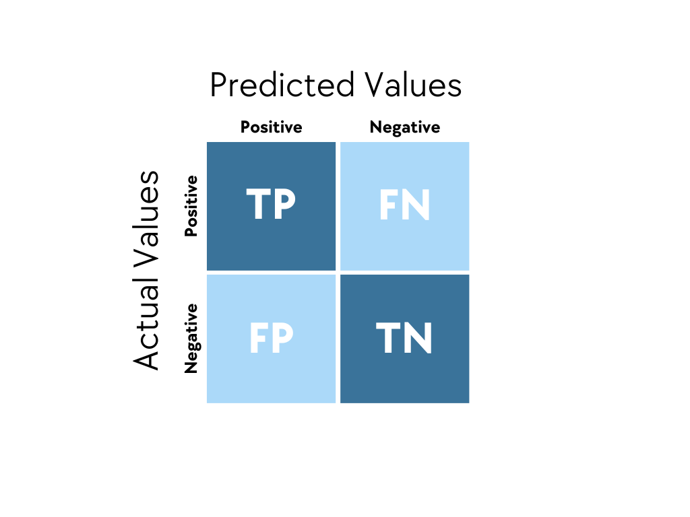
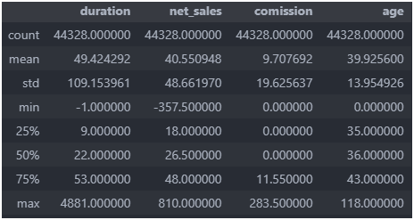
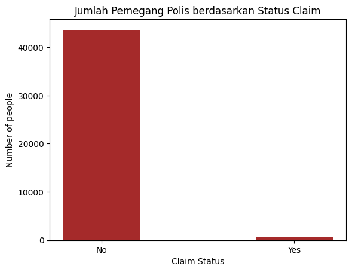
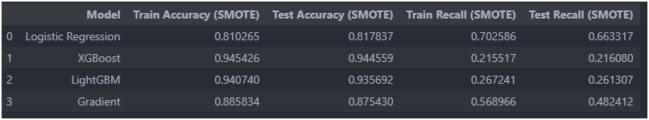
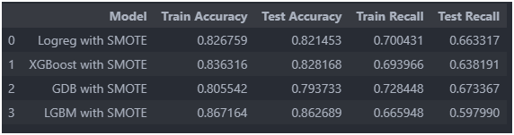
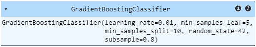
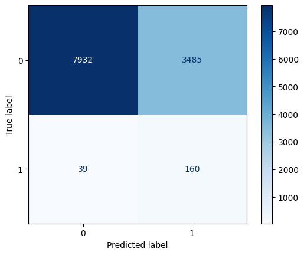

# Travel Insurance Insurance Claim
- Kemas Veriandra Ramadhan
- Capstone 3
- JCDS - 018
  

## Intorduction and Goals

Asuransi perjalanan adalah jenis asuransi yang memberikan perlindungan selama bepergian, baik di dalam negeri maupun ke luar negeri. Perusahaan yang bergerak di bidang asuransi perjalanan ingin mengidentifikasi pemegang polis yang berisiko mengajukan klaim asuransi. Dengan mengetahui pemegang polis yang berisiko, erusahaan asuransi perjalanan ingin mengurangi kerugian finansial yang besar akibat klaim yang tidak terdeteksi dengan memprediksi pemegang polis yang kemungkinan besar akan mengajukan klaim. Maka dari itu pemodelan klasifikasi kali ini berfokus untuk mengejar nilai recall dan pengaturan treshold dari keseimbangan PR-Curve.

- Metric Evaluation

Evaluasi metric model klasifikasi umumnya menggunakan confusion matrix sebagai tahap awal pengindentifikasian metric lebih lanjut. Confusion Matrix berisi beberapa komponen seperti:

---
- True Positives (TP):

Jumlah kasus di mana model dengan benar memprediksi kelas positif (misalnya klaim yang benar-benar terjadi).

Artinya, model memprediksi klaim terjadi, dan memang benar klaim tersebut terjadi.

- False Positives (FP):

Jumlah kasus di mana model salah memprediksi kelas positif (misalnya klaim yang tidak terjadi tetapi diprediksi terjadi).

Artinya, model memprediksi klaim terjadi, tetapi klaim tersebut tidak terjadi (error tipe 1).

- True Negatives (TN):

Jumlah kasus di mana model dengan benar memprediksi kelas negatif (misalnya klaim yang tidak terjadi).

Artinya, model memprediksi klaim tidak terjadi, dan memang benar klaim tersebut tidak terjadi.

- False Negatives (FN):

Jumlah kasus di mana model salah memprediksi kelas negatif (misalnya klaim yang terjadi tetapi diprediksi tidak terjadi).

Artinya, model memprediksi klaim tidak terjadi, padahal klaim tersebut memang terjadi (error tipe 2).

Metrics yang digunakan pada pemodelan klasifikani ini yaitu 

- Reccall

Recall (atau sering disebut Sensitivity, True Positive Rate, atau Hit Rate) adalah metrik evaluasi yang digunakan dalam masalah klasifikasi untuk mengukur seberapa baik model dalam menangkap atau mengidentifikasi kasus yang benar-benar positif. Secara umum, recall mengukur proporsi dari seluruh kasus positif yang sebenarnya (dalam konteks ini, kasus yang memiliki klaim) yang berhasil diprediksi dengan benar oleh model. Ini memberikan gambaran tentang seberapa efektif model dalam "menangkap" kelas positif, atau dengan kata lain, seberapa baik model menghindari False Negatives (FN).

# EDA
Menggunakana Dataset Travel Insurance, didapatkan atribut data seperti ini:
1. agency: nama agensi atau perusahaan yang menjual polis asuransi
2. agency_type: tipe agensi asuransi (maskapai/travel)
3. distribution_channel : saluran distribusi agnsi (online/offline)
4. gender: jenis kelamin pembeli asuransi
5. product_name: nama produk asuransi
6. duration: lama waktu perjalan (hari)
7. destination: tujuan perjalanan (negara)
8. comission: komisi yang diterima agensi asuransi perjalana
9. age: usia pembeli asuransi perjalanan
10. claim: status klaim asuransi atau tida klaim asuransi

Berdasarkan statistik deskriptif ditemukan bahwa
1. terdapat anomali pada duration yaitu durasi perjalan ada yang dibawah 1 hari dimana ini tidak valid serta total jumlah perjalanan maksimum mencapai 4881 hari hal ini akan diinvestigasi lebih lanjut
2. terdapat kenaehan pada kolom age yaitu umur paling kecil adalah 0 tahun dan umur tertinggi adalah 118 tahun dimana jarang sekali manusia yang dapat bertahan hidup lebih dari 100 tahun.
3. terdapat net_sales atau penjualan minus mencapa -357 hal ini perlu diinvestigasi lebih lanjut.

Berdasarkan hasil temuan tersebut, kita dapat melakukan investigasi lebih lanjut dengan melihat domain dari penggunaan polis asuransi perjalanan. Sehingga tidak menggunakan asusmsi pribadi untuk menangani data anomali/outlier.

Berdasarkan barplot di atas, terlihat bahwa data yang dimiliki termasuk imblanced karena hampir 98% mayoritas data status claimnya tidak sedangkan sisanya 1% melakukan klaim. dengan:
- jumlah pemegang polis yang melakukan claim: 677
- jumlah pemegang polis yang tidak melakukan claim: 43651
- proporsi pemegang polis yang melakukan claim: 0.015
- proporsi pemegang polis yang tidak melakukan claim: 0.98

## Mising Value
 - Ditemukan missing value sebesar 31647 pengguna pada kolom gender, Aksi yang dilakukan adalah menghapus kolom tersebut.

## Duplicate
- Ditemukan duplikasi data dengan jumlah 5004 data. Karena data tidak memiliki id customer ataupun id transaksi, maka kit dapat menghapus data duplikat tersebut yang mana tidak akan menggangu proses klasifikasi nantinya.

## Invalid Data

- Terdapat anomali lama perjalanan customer mencapai > 4000 hari, hal ini harusnya tidak masuk kedalam kategori pengajuan klaim maka dihapus untu ketentuan kolom duration yang memiliki lama perjalanan >540 hari

- Terdapat anomali pada kolom age yaitu umur manusia yang lebih dari 100 tahun dan bayi yang berumur 0 tahun/  < 12 bulan. Kedua rentang usia ini, tidak termasuk ke dalam TnC perusahaan asuransi misal seperti (citilink,Axa), Usia yang diterima oleh penyelenggaara asuransi perjalanan berkisar umum 1 tahun - 75 tahun. Maka untuk data yang tidak termasuk rentang ini akan di hapus datanya.
 
- Ditemukan net sales bernilai minus, setelah ditelusuri lebih jauh ternyata hal itu wajar mendapatkan net sales minus karena terhitung pendapatan bersih.

# Feature Engginerring

- Melakukan Encoding One Hot dan Binary untuk dats kategori seperti:
    - Onehot_category = ['agency_type', 'distribution_channel']       
    - binary_category = ['agency', 'product_name', 'destination']
- Melakukan Robust Scaler untuk data numeric seperti:
    - numerical_features = ['duration', 'net_sales', 'comission', 'age']
- Melakukan Label Encoding Manual No/Yes -> 0/1 untuk target 'claim'

# Base Model
- Menggunakan Pipeline dan beberapa Model sebeperti
    - Regresi Logistik
    - XGBoost
    - Gradient Boost
    - LGBM Boost

## Handling Imbalanced Data
- Menggunakan SMOTE

Berdasarkan pengujian model didapatkan hasil akhir akurasi model dan recall sebagai berikut:

Berdasarkan hasil resampling menggunakan SMOTE didapatkan bahwa hasil metrik recall yang mendekati nilai terbaik adalah metrik recall pada model Regresi Logisctic dengan nilai recall sebesar 66% dengan akurasi mengalami penurunan menjadi 82%. Karena melihat angka recall yang mungkin dapat dikejar untuk dinaikkan nilainya maka untuk proses hyperparamater tuning, kita menggunakan Regresi Logistic dan mempertimbangkan model lain juga.

## HyperParameter Tuning
Menggunakan RandomizeSearch untuk masing-masing Model.

Berdasarkan hasil akurasi dan recall tiap model yang telah dituning parameternya dan penggunaan smote, didapatkan pilihan model akhir yang akan digunakan yaitu Gradient Booting dengan nilai Akurasi sebesar 79 % untuk akurasi test dan 67 % untuk recall test.

# Final Model

Menggunakan model GradientBoosting dengan parameter yang digunakan yaitu

Serta treshold sebesar 0.4, didapatkan hasil confusion matrix seperti berikut:

Hasil akhir dari pencarian model yang digunakan adalah menggunakan model GradientBoosting. Dengan melakukan tuning tambahan pada model tersebut seperti memebuat data sintetik melalui SMOTE untuk menambah kelas minoritas (kelas 1). Selain itu dilakukan pencarian parameter terbaik menggunakan randomizedsearch, dimana membantu mencari parameter terbaik untuk model berdasarkan distribusi dari nilai-nilai acuann yang kita masukkan. 
Didapatkan tuningan Gradient Boosting terbaik yaitu:
- learning_rate=0.01

Learning rate mengontrol seberapa besar perubahan yang dilakukan oleh model pada setiap iterasi pembelajaran. Dengan learning_rate yang lebih kecil, model akan melakukan perubahan yang lebih kecil dan lebih hati-hati. Dalam kasus ini, nilai 0.01 berarti model berusaha untuk belajar dengan lebih lambat dan bertahap, yang dapat membantu mencegah model menjadi terlalu cepat terjebak pada pola yang kurang tepat (overfitting).

- min_samples_leaf=5,

Min_samples_leaf adalah jumlah minimum sampel (data) yang dibutuhkan dalam sebuah daun (leaf) dari pohon keputusan. Setiap kali model membagi data menjadi dua, pohon keputusan akan memastikan bahwa setiap cabang memiliki setidaknya 5 sampel di setiap daunnya. Parameter ini membantu menghindari overfitting dengan memastikan bahwa pohon keputusan tidak membuat pembagian yang terlalu spesifik yang hanya berlaku untuk sebagian kecil data.

- min_samples_split=10

Min_samples_split adalah jumlah minimum sampel yang diperlukan untuk membagi sebuah node (simpul) pada pohon keputusan. Dengan nilai 10, model hanya akan membagi node jika ada setidaknya 10 sampel di dalamnya. Ini membantu mencegah model untuk membuat terlalu banyak pembagian yang terlalu rinci pada data, sehingga mengurangi risiko overfitting.

- random_state=42,

Random_state digunakan untuk memastikan bahwa proses pembelajaran dapat direplikasi dengan hasil yang sama di setiap kali model dilatih. Dengan menetapkan nilai 42 (nilai acak), Anda dapat memastikan bahwa hasil eksperimen yang Anda lakukan dapat diulang pada percakapan berikutnya, tanpa perubahan yang tidak diinginkan dalam pembelajaran model.

- subsample=0.8

Subsample mengontrol proporsi data yang digunakan untuk melatih setiap pohon keputusan dalam ensemble. Nilai 0.8 berarti model hanya menggunakan 80% dari data untuk melatih setiap pohon secara acak. Dengan cara ini, model tidak hanya bergantung pada seluruh data, tetapi mencoba untuk menghindari overfitting dengan memanfaatkan data yang berbeda pada setiap iterasi. Ini membantu membuat model lebih general dan tidak terlalu terfokus pada pola yang sangat spesifik di data pelatihan.

Prediksi akhir model untuk akurasi sebesar 69.7% hal ini masih dapat dikatakan baik untuk sebuah nilai akurasi model. Kemudian untuk Recall yang didapatkan dari model ini untu kelas 1 yaitu sebesar 80.4 % dimana artinya model mampu menangkap sebagian  orang yang berkesempatan mengajukan klaim. Hal ini tentunya mencegah perusahaan asuransi melewatkan seseorang yang ingin klaim asuransi namun tidak terdeteksi oleh model (FN). 
Berikut intepretasi akhir model GradientBoosting melalui Confusion Matrix
- True Positives (TP): 160

Ini adalah jumlah kasus di mana model dengan benar memprediksi bahwa klaim akan terjadi (1). Artinya, ada 160 klaim yang benar-benar terjadi dan model memprediksi dengan tepat.

- False Positives (FP): 3485

Ini adalah jumlah kasus di mana model salah memprediksi klaim yang tidak terjadi (0) menjadi klaim yang terjadi (1). Artinya, ada 3485 klaim yang sebenarnya tidak terjadi, tetapi model memprediksi bahwa klaim tersebut akan terjadi.

- True Negatives (TN): 7932

Ini adalah jumlah kasus di mana model dengan benar memprediksi klaim tidak terjadi (0). Artinya, ada 7932 klaim yang memang tidak terjadi dan model memprediksi dengan benar.

- False Negatives (FN): 39

Ini adalah jumlah kasus di mana model salah memprediksi klaim yang terjadi (1) menjadi klaim yang tidak terjadi (0). Artinya, ada 39 klaim yang seharusnya terjadi, tetapi model memprediksi bahwa klaim tersebut tidak akan terjadi.

Disamping itu, masih terdapat kekurangan yang ada pada model, dimulai dari lamanya mencari tuningan model yang tepat. Kemudian model masih kesulitan membaca data yang klaimnya kelas 1 (ya) yang diakibatkan imbalanced data walaupun sudah dilakukan handling imbalanced data dengan SMOTE. Selain itu dengan tingginya angka FP dapat dikatakan juga bahwa model membiarkan klaim yang tidak terjadi secara berlebihan.

# Conclusion and Recomendation

Berdasarkan hasil pemodelan ini, didapatkan kesimpulan dan rekomendasi yaitu:
1. Model sudah cukup untuk mendeteksi klaim yang akan benar-benar terjadi (Recall) dengan nilai recall yaitu 80 %.
2. Model dapat digunakan ketika perusahaan asuransi ingin memastikan bahwa seseorang akan mengajukan klaim dan dapat menanggung biaya klaim.
3. Model tidak dapat digunakan lebih lanjut jika memang data yang didapatkan imbalanced atau tidak terbagi rata jumlah datanya ketiap kelasn.
4. Penggunaan model klasik seperti regresi logistik masih mampu mendapatkan hasil yang baik. Namun perlu diperhatikan kembali asumsi-asumsi yang harus dipenuhi
4. Untuk pemodelan selanjutnya, diharapkan data yang digunakan lebih mendetail seperti penambahan id customer, riwayat perjalanannya,banyaknya customer melakuakn perjalanan, dll
